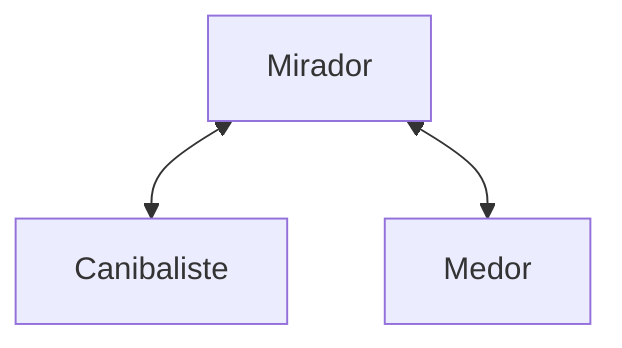

# picam_2023

Ce repository contient le code de détection des gâteaux. Ce fichier est fait pour les pistouks en tout genre.

## Installation

1. Créer un environnement virtuel et l'activer (recommandé)
2. Clone le repository avec `git clone https://github.com/heigvd-eurobot/picam_2023.git`
3. Se déplacer dans le dossier avec `cd picam_2023`
4. Installer les dépendances avec `pip install -r requirements.txt`

## Lancement

1. S'assurer d'être dans le dossier picam_2023
2. Lancer le script `python server.py` sur le serveur (mirador)
3. Lancer le script `python client.py` sur la caméra (medor ou canibaliste)

## Contenu

- le dossier cakeDetector contient le code de détection des gâteaux.
- le dossier cakeExtractor contient le code qui permet d'extraire un crop des gâteaux.
- le dossier cakeSorter contient le code qui permet de classifier les gâteaux.
